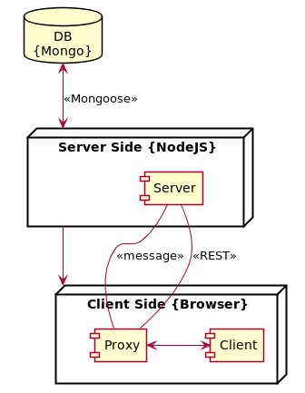

# Pogled na razmeštaj aplikacije Grafaro

U ovom dokumentu je prikazan razmeštaj aplikacije Grafaro.

Glavni čvor razmeštaja čini server koji ostvaruje konekciju sa bazom. Prilikom ostvarivanja pristupa korisnika (odnosno korisničkog čvora), korisnik dobija bandlovanu (_bundled_) verziju klijentske komponente koja se izvršava u njegovom pregledaču.

Pogled razmeštaja je dat na sledećem dijagramu:

