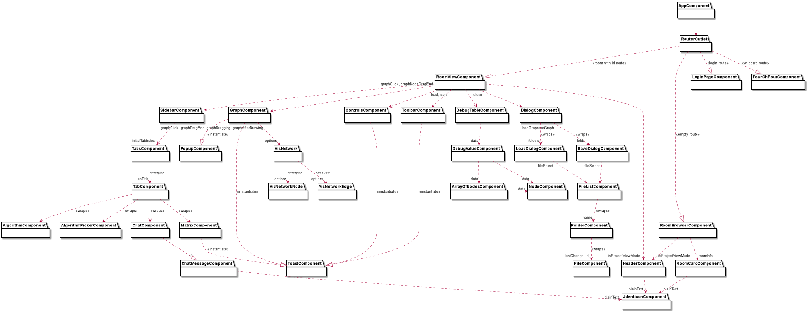
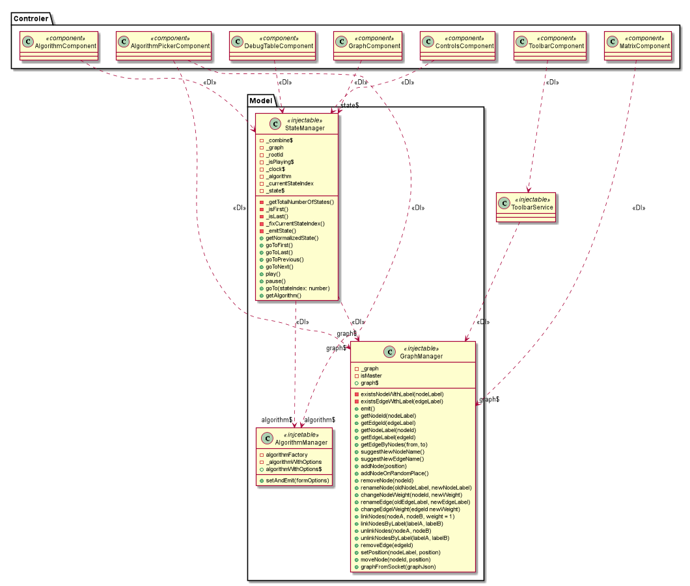
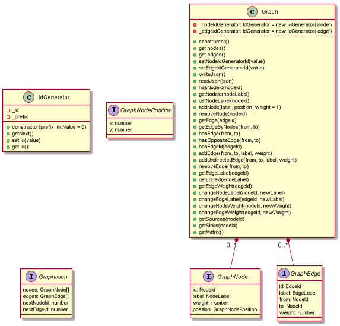
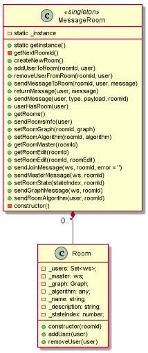

# Logički pogled aplikacije Grafaro

U ovom dokumentu će biti predstavljen logički pogled aplikacije Grafaro.

Kako je reč o Angular aplikaciji, biće predstavljena hijerarhija komponenti, sa odgovarajućim `input` i `ouptput` propertijima.
Takođe će biti predstavljen i pogled na klase modela i biti opisan način njihovog funkcionisanja, kao i mogućnosti proširenja kod klasa koje definišu algoritam.
Biće prikazan i opisan način dotoka podataka u kontrolerske komponente, kao i način funkcionisanja Proxy komponente.
Na kraju dokumenta će biti prikazan osnovni logički pogled na serversku komponentu.

## Hijerarhija komponenti

Kako je Grafaro aplikacija zasnovana na Angular frejmvorku, bitno je dati pregled hijerarhije Angular komponenti i način njihovog međusobnog komuniciranja. Pre dijagrama hijerarhije, sledi par napomena vezanih za notaciju:

- Elementi dijagrama su predstavljeni kao moduli jer smatramo da je to najpogodniji UML element za prikaz istih. Angular komponente i predstavljaju module koji enkpasuliraju određene funkcionalnosti kroz potrebne HTML šablone, servise i komponentske klase.
- `RouterOutlet` je komponenta iz Angular jezgra koja služi za instanciranje komponentskih klasa na osnovu pročitane URL rute. Na dijagramu je stereotipima označeno koja ruta aktivira instanciranje koje komponente. Kao konektor elemenata, korišćena je standardna UML notacija za instanciranje.
- Usmerena isprekidana strelica od jedne komponente do druge označava da je druga komponenta podkomponenta prve komponente. Sa strane prve komponente je dat naziv `output` propertija za koje se vezuje prva komponenta, a sa strane druge komponente je dat naziv `input` propertija koje prosleđuje prva komponenta.
- Stereotip `wraps` označava da se prva komponenta obavija drugu u komponenti iznad druge, a ne u samoj komponenti.
- Stereotip `instantiate` označava da prva komponenta na određene događaje instancira drugu komponentu programski, a ne kroz svoj šablon.

Dijagram hijerarhije komponenti:

Sa dijagrama se vidi da je ulazna komponenta `AppComponent` koja sadrži samo `RouterOutlet`.
Takođe se može uočiti da centralni deo aplikacije predstavlja `RoomViewComponent` koja enkapsulira skoro komplentu funkcionalnost kroz odgovarajuće komponente korisničkog interfejsa.

## Pogled na klase modela

Komponentu modela čine tri klase: `GraphManager`, `AlgorithmManager` i `StateManager` koje su zadužene, redom, za čuvanje trenutnog modela grafa, čuvanje trenutno odabranog algoritma i odgovarajućih opcija i izračunavanje trenutnog stanja na osnovu datog grafa i algoritma.
Ovde je bitno napomenuti da su ove tri klase singltoni i da su dostupni kroz Angularov dependency injection (DI) frejmvork (o kome se može pročitati više u dokumentu vezanom za obrasce, [di-pattern](../patterns/di-pattern.md)).
Grafički je DI prikazan kao obična relacija zavisnosti sa stereotipom `DI`.
Dijagram predstavlja zavisnosti pojedinih kontrolerskih klasa u odnosu na modele, sa detaljnim prikazom modela.

Kada govorimo o klasa modela, potrebno je predstaviti i reprezentaciju grafa kroz klasu `Graph`, koja je dostupna kroz tok Observabla klase `GraphManager`, kao i ostale bitne interfejse i klase za njeno funkcionisanje:
 

## Klasa algoritama

Zbog sličnosti sa temom, opis klase algoritama i njihova mogućnost proširenja je data u posebnom dokumentu, [extending-algorithms.md](../patterns/extending-algorthms.md).

## Proxy sloj

Pogled na hijerarhiju klasa Proxy sloja je dat u dokumentu sa kompletnim pregledom projektnih obrazaca, [patterns.md](../patterns/patterns.md).
Ovde je bitno napomenuti samo da klase Proxy sloja su u vezi sa klasama kontrolera i da kontroleri dobijaju ulazne podatke na osnovu kojih vrše promene modela baš od strane ovih klasa.
Preko klasa Proxy sloja teče kontrolisana razmena poruka koja omogućava rad aplikacije u slučaju otkaza servera.

## Pogled serverskog dela

Logički pogled servera će biti dat kroz dijagram singlton klase za čuvanje i manipulacijom nad sobama i soba.
Pored ovih klasa, na serveru postoji i niz soketa koji predstavljaju pojedinačnog korisnika trenutno povezanog na server, ali zbog prirode UML dijagrama, nije moguće prikazati ovu statičku promenljivu lepo.

