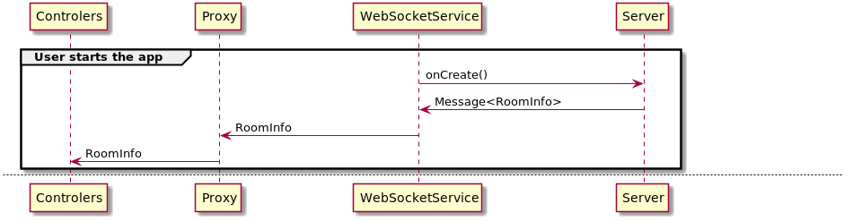
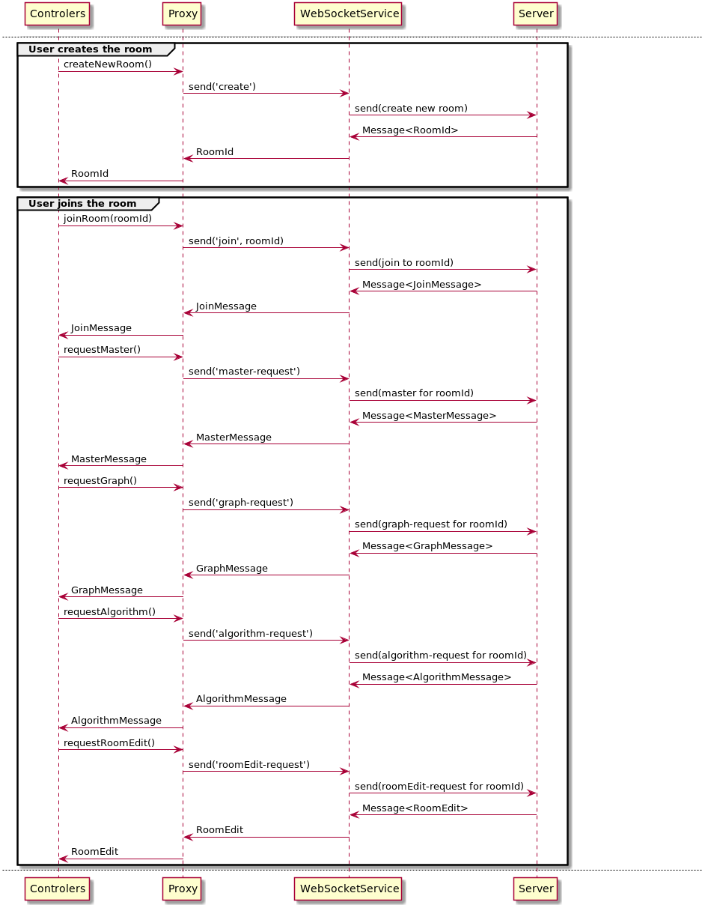
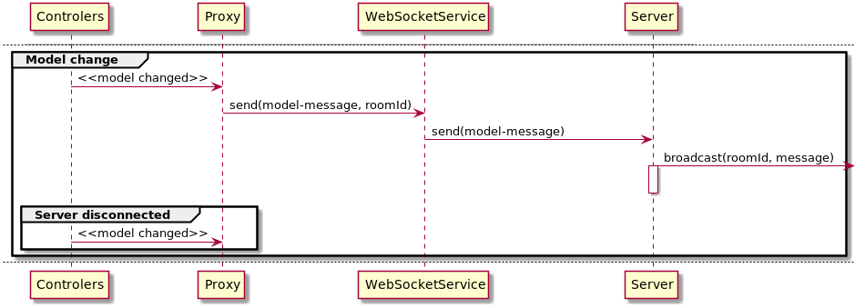
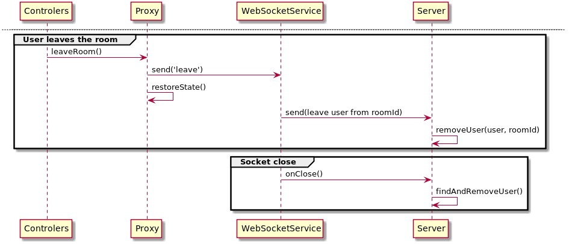

# Procesni pogled aplikacije Grafaro

U ovom dokumentu će biti predstavljen procesni pogled na aplikaciju Grafaro.

Od procesnih pogleda, biće predstavljen pogled na tok razmenu poruka i pogled na funkcionisanje `ToolbarComponent` korišćenjem Rx Marbles dijagrama.

## Tok razmene poruka

U ovom delu će biti predstavljeni dijagrami sekvenci toka razmene poruka između klijenta i servera i klijenta i drugih klijenata putem servera kao posrednika.

Napomenimo da sistem raspolaže Proxy komponentom koja služi za pravilno procesuiranje poruka i slučaju nedostupnosti servera. Ova komponenta je u direktnoj sprezi sa kontrolerima.

Naredni dijagrami prikazuju sekvence toka razmene poruka u različitim slučajevima, pri čemu se kao povratna informacija uglavnom dobija podatak poruke koji se filtrira i u WebSocketService objektu:

* Početna sekvenca -- razmena poruka prilikom kreiranja soket konekcije.

* Sekvenca kreiranja i pristupa sobi -- razmena poruka prilikom kreiranja i pristupanja sobi. Korisnik koji pristupa sobi ne prolazi kroz sekvencu kreiranja sobe.

* Sekvenca promene modela -- razmena poruka prilikom promena modela (reflektuje se kroz kontroler). Događa se samo ukoliko se model promenio kod korisnika koji je _Master_ sobe. Na ovoj sekvenci je pokazana uloga Proxy komponente u kontrolisanom pristupu serveru u slučaju kada ne postoji konekcija sa serverom, prilikom čega Proxy komopnente ne radi ništa na prijem promene modela.

* Sekvenca napuštanja sobe i prekida konekcije -- razmena poruka prilikom napuštanja sobe od strane korisnika ili prekida konekcije sa soketom.

## Procesni tok komponente ToolbarComponent

Zbog čitljivosti dokumenta i sličnosti teme sa dokumentom koji opisuje korišćene projektne obrasce, procesni tok komponente `ToolbarComponent` je dat u zasebnom dokumentu, [observable-toolbar.md](../patterns/observables-toolbar.md).
