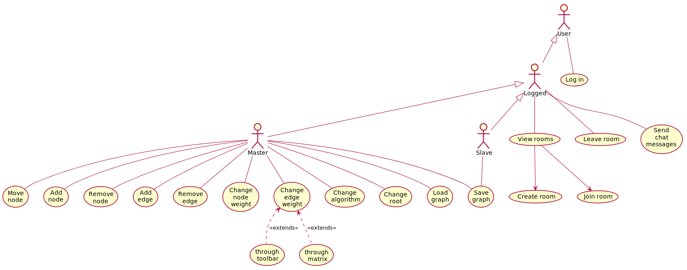

# Pogled slučajeva korišćenja

U ovom dokumentu je dat pogled na slučajeve korišćenja.

Kako bi korisnik mogao da koristi sistem, prvo se mora autentikovati na sistem korišćenjem postojećeg Facebook, Google ili Twitter naloga.
Ulogovani korisnik zatim može da pregleda sobe i da kreira novu ili da pristupi već postojećoj.
Korisnik, tek nakon pristupa sobi, ima mogućnost razmene chat poruka, a takođe i tada tek može da napusti sobu.

Kada korisnik pristupi postojećoj sobi, uglavnom je to u vidu _Slave_ korisnika koji, pored posmatranja grafa i slanja poruka, može i da čuva trenutno nacrtani graf. _Slave_ korisnik postaje _Master_ tek kada on postojeći _Master_ izađe iz sobe i on je najstariji (u smislu vremena provedenog u sobi) korisnik od svih ostalih prisutnih.
 
 _Master_ korisnik ima mogućnost manipulacije nad grafom, odabirom algoritama, menjanje opcija algoritama i promene stanja algoritma.
 
 Pogleda slučaja korišćenja je dat na sledećem dijagramu, pri čemu usmerena strelica od slučaja korišćenja ka slučaju korišćenja znači da je naredni slučaj dostupan tek nakon što se prvi slučaj desio:

