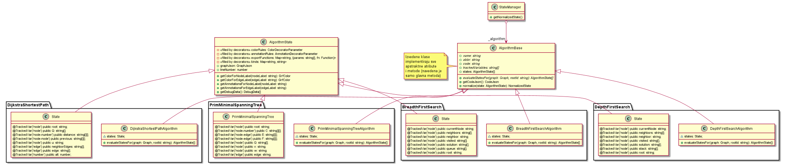
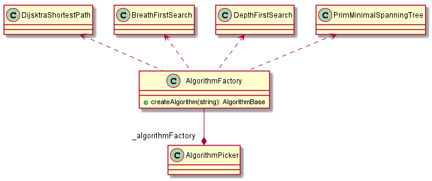
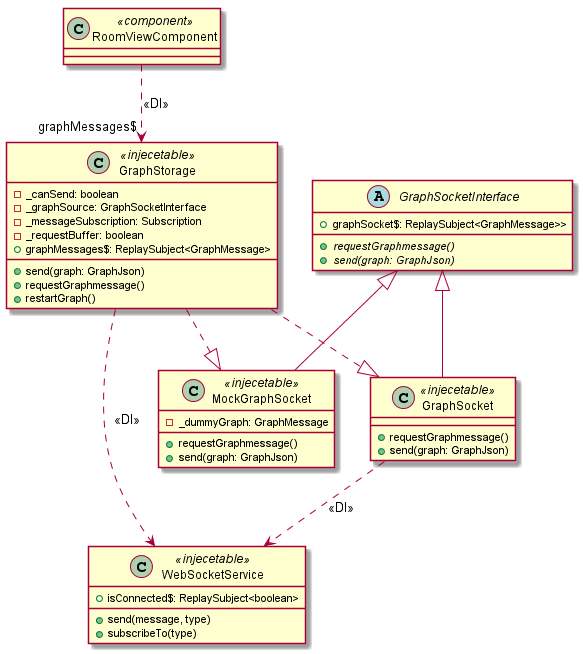

# Obrasci u aplikaciji Grafaro

Ovaj dokument opisuje sve prisutne obrasce koji su primenjni u razvoju aplikacije grafaro.

Za razvoj aplikacije je korišćen TypeScript, tipizirani nadskup JavaScripta, koji podržava ECMAScript 6 klase, tako da je u samom razvoju i bilo moguće primeniti objektno-orijentisane projektne obrasce.
 
U razvoju same aplikacije primenjeni su _singleton_, _strategy_, _dependency injection_, _interpretator_, _proxy_, _transaction script_, _observable_, _factory_, _iterator_ i _template view_ obrasci.
  
## Singleton

Ovaj obrazac se pojavljuje na više mesta kroz aplikaciju.
Sve klase u aplikaciji sa Angular dekoratorom `@Injectable` predstavljaju singleton instance dostupne kroz Angular DI frejmvork.
Ovo je jedna od osobenosti Angulara koja će detaljniji biti opisana u delu koji objašnjava DI obrazac.

Ručno implementirani singleton je klasa za manipulaciju soba na serveru.
Ova klasa je singleton jer je namena ove klase da služi kao kontroler u prosleđivanju poruka odgovarajućim sobama, zato ne bi bilo dobro, sa projektantske strane, da postoji više instanci ove klase.
Dijagram sledi u nastavku:

## Strategy

Strategy obrazac je iskorišćen za enkapsulaciju različitih algoritama za izvršavanje nad grafom.
Svi algoritmi nasleđuju osnovno klasu algoritama i implementiraju apstraktnu funkciju za evaluaciju stanja.
Strategija za evaluaciju stanja se nalazi u klasu `StateManager` koja vrši evaluaciju stanja na osnovu trenutnog grafa i opcija.
Strategija je u vidu konkretnog objekta iz hijerarhije algoritama.
Detaljno objašnjenje o načinu proširenja ove hijerarhije se može videti u dokumentu [extending-algorithms.md](extending-algorthms.md). U nastavku je dat dijagram ovog obrasca u sistemu:

## Dependency injection
 
Detaljno objašnjenje rada i korišćenja DI obrasca je dato u dokumentu [di-pattern.md](di-pattern.md).
Kao što je navedeno u dokumentu, DI je korišćen pre svega radi pružanja singleton servisa i radi lakše mogućnosti testiranja i zamene pravih klasa sa imitirajućim klasama.

Sledi dijagram koji delimično opisuje korišćenje DI obrasca u aplikaciji Grafaro, gde treba napomenuti da su sve klase sa stereotipom `injecetable` singleton objekti:

## Interpretator

Ovaj obrazac nije direktno implementira, već se koristi gotov paket `marked` koji parsira markdown (`.md`) stringove u četu, što omogućava korisnicima da koriste jednostavnu sintaksu za formatiranje poruka (bold, kurziv, emotikoni, itd).
Nema propratnog dijagrama jer obrazac nije ručno implementiran.

## Transaction script

Ovaj obrazac je iskorišćen na serverskoj strani u definisanim REST API putanjama. Zbog prirode JavaScripta, svaki poziv neke od putanja predstavlja izvršenje nekog skripta koji obavi određenu komunikaciju sa bazom korišćenjem Mongoose biblioteke. Dijagram za ovaj obrazac nije dat jer smatramo da nije potrebno crtati nikakvu šemu za ovaj obrazac.

## Observable

Observable obrazac je definisan kao kombinacija observera, iteratora i ideja funkcionalnog programiranja.
Primenjen je u projektu radi lakšeg upravljanja asinhronim procesima.
Takođe je primenjen na svim mestima gde bi se primenio i klasičan observer obrazac.
Detaljno objašnjenje sa adekvatnim dijagramima je dato u dokumentu [observable-toolbar.md](observables-toolbar.md).

## Template View

Obrazac template view je jedna od osobenosti Angular frejmvorka jer svaka klasa komponente uz sebe definiše i šablonski HTML koji se posebnom sintaksom dinamički populiše dobijenim podacima iz klase.
Klasa komponente predstavlja kontrolera, dok šablonski HTML predstavlja view u MVC obrascu.
Angular je kao tehnologija odabran, između ostalog, baš iz razloga što pruža šablonizaciju pogleda i mogućnost lake maniplacije korisničkim interfejsom.

## Factory

Ovaj obrazac je primenjen u svojoj najjednostavnijoj formi u klasi `AlgorithmFactory` koja na osnovu stringa koji dobije odlučuje koji će se algoritam instancirati i proslediti kao nova strategija klasi `StateManager`.
Iskorišćen je radi centralizovane logike pri dodavanju novih algoritama u aplikaciju. 
Sledi dijagram:

## Iterator

Iterator je obrazac koji je već ugrađen u sam JavaScript, a samim tim i u TypeScript. Ovaj obrazac je korišćen svugde gde je bilo potrebno vršiti bilo kakav obilazak niza objekata, filtriranje ili mapiranje. Detaljniji opis ovog obrasca je u dokumentu [javascript-iterators](javascript-iterators.md).

## Proxy

Proxy obrazac je iskorišćen u aplikaciji Grafaro kako bi omogućio rad aplikacije u dva režima: više-korisnički (kada je aplikacija povezana sa serverom) i jedno-korisnički (kada ne postoji veza).
Korišćenjem ovog obrasca je dobijena kontrola pristupa.
Napomenimo samo da se strukturno primena ovog obrasca razlikuje od GoF strukture, ali da je njegova namena i slučaj korišćenja i namera isti, tako da je sledeća hijerarhija klasa podvedena pod ovaj obrazac:
 

Ova hijerarhija se ponavlja i za ostale klase koje su u direktnoj vezi sa serverom, poput `MasterStorage`, `JoinStorage`, `ChatStorage` i svih ostalih `Storage` klasa.

U konkretnom slučaju, `GraphStorage` klasa pre svega vrši proveru da li postoji konekcija preko soketa i na osnovu toga vrši instanciranje odgovarajuće `Socket` klase.
Zatim se pretplaćuje na promene Subject propertija i na osnovu tih promena vrši emitovanje svog propertija `graphMessages$`.
Ova klasa ima slične interfejsne metode čija je uloga delegiranje zahteva ka pravoj instanci izvorišta poruka.
